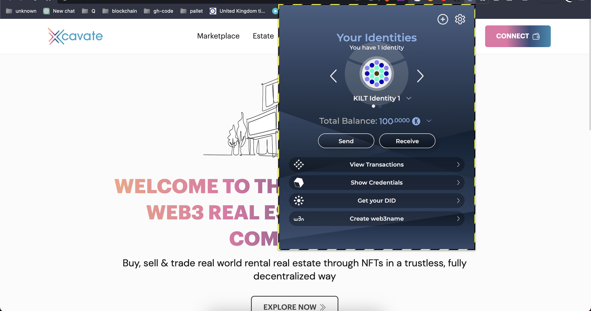

# Backend

1. Complete the <a href="https://docs.substrate.io/install/">basic Rust setup instructions</a>
2. Clone Xcav chain <a href="https://github.com/XcavateBlockchain/MarketplaceMVP_Substrate">xcavate chain repo</a> and follow instructions from readme file.

# Frontend

1. DApp development with Sporran, use <a href="https://github.com/BTE-Trusted-Entity/sporran-extension/blob/main/docs/external.md">this link</a>configure sporran wallet and get some test tokens

2. Get your DID from sporran wallet
   

3. Download PolkadotJs extension in browser and create new account by following the <a href="https://polkadot.js.org/extension/">this link</a>

4. Clone MVP_Frontend from xcav repository using <a href="https://github.com/XcavateBlockchain/MVP_Frontend">this link</a>
   and follow instructions from readme file

5. Run MVP_Frontend and open `http://localhost:3000/` in your browser

6. Clone MVP_Backend from xcav repository using <a href="https://github.com/XcavateBlockchain/MVP_Backend">this link</a> and follow instructions from readme file then run MVP_Backend

7. Connect sporran wallet in MVP_Frontend and attested developer credentials, Instruction is listed in below link
